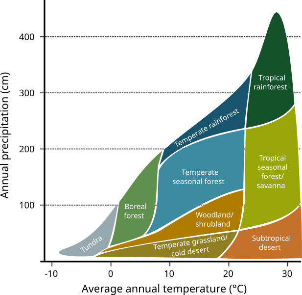

Approximation of the following distribution
([source](https://commons.wikimedia.org/wiki/File:Climate_influence_on_terrestrial_biome.svg)):

    t :: temperature [degrees C]
    p :: precipitation [cm/year]

    temperature < 0                => Tundra
    temperature < 8
      p < 30                       => Cold desert
      else                         => Boreal forest
    temperature < 20
      p < 30 + (t - 8) * 20 / 12   => Cold desert
      p < 50 + (t - 8) * 70 / 12   => Woodland/shrubland
      p < 180 + (t - 8) * 60 / 12  => Temperate forest
      else                         => Temperate rainforest
    else
      p < 50 + (t - 20) * 50 / 10  => Subtropical desert
      p < 240 + (t - 20) * 40 / 10 => Savanna
      else                         => Tropical rainforest
