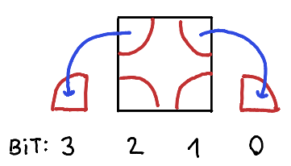
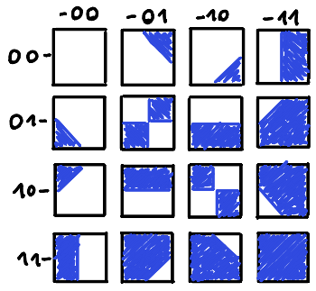

[Wikipedia](https://en.wikipedia.org/wiki/Marching_squares) has a good
general description of the algorithm; here we focus on the specific case
where input samples are binary (0/1, background/foreground, empty/full,
water/land...)

Somewhat related: <https://doc.mapeditor.org/en/stable/manual/terrain/>

## Coordinate system

Each cell is determined by its 4 corners -\> N×N input produces
(N-1)×(N-1) output cells

There are two possible interpretations of the input coordinate system;
this makes no difference to the algorithm itself, it just changes how
you would display the result.

### Samples in cells *corners*

Grid and sample coordinates are integers.

Like a heightmap, this requires an odd number of points for an
even-sized grid and vice versa.

### Samples in cell *centers*

This often makes sense in grid-based games/simulations, since the
samples can directly determine properties of their corresponding cells.

Grid coordinates would normally be integers, while centers would be
offset by 0.5 (but the converse is also possible, with the grid starting
at -0.5).

Grid size is unchanged, but a half-unit-wide border remains without
data.

A possible workaround is to pad the input data with a fixed value on all
4 sides.

## Ambiguity

Saddle points are ambiguous, in particular if input samples are binary.
There are multiple conceivable strategies to resolving this:

The simplest solution is to just choose one and stick to it (can also
alternate based on x, y)

## Indexing convention

For tile look-up, it's useful to define a numbering convention, that is,
a way of assigning indexes 0 to 15 to the 16 different combinations of
corner values. The choice is completely arbitrary. I like the following
one, since it is easy to remember:

The tile look-up table then looks like this:

## My implementation

In Tilevision:
<https://github.com/mcejp/tilevision/blob/41bbc61ff3e632a5084d55d8db73bea7498c9092/tilevision/path_util.py#L34>
(note: uses a different indexing convention)
